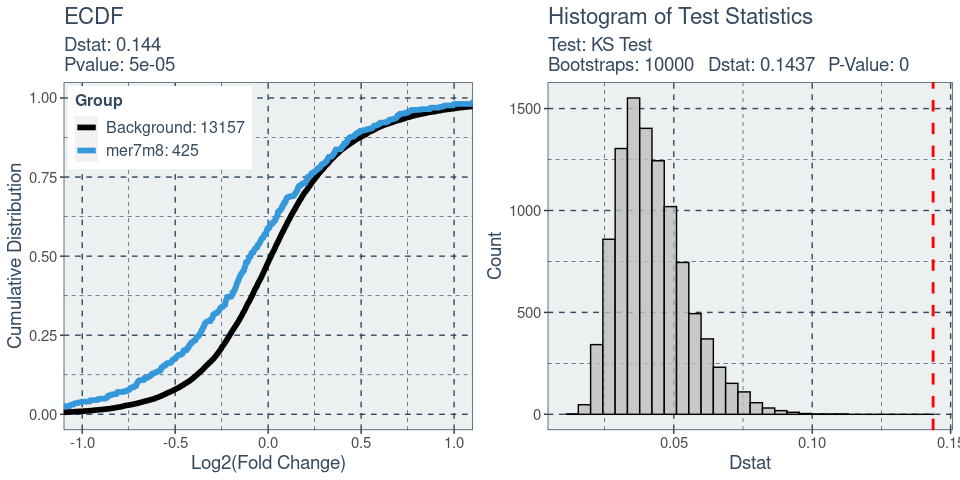

<!-- README.md is generated from README.Rmd. Please edit that file -->

# SeedMatchR

<!-- badges: start -->

[](https://github.com/tacazares/SeedMatchR/actions/workflows/R-CMD-check.yaml)
<!-- badges: end -->

The goal of SeedMatchR is to help users identify potential seed-mediated
effects in their RNAseq data.

## Installation

You can install the development version of SeedMatchR from
[GitHub](https://github.com/) or the stable build from CRAN.

``` r
# Install from GitHub
install.packages("devtools")
devtools::install_github("tacazares/SeedMatchR")
```

## Quick start example with public siRNA data

This example uses the siRNA sequence, D1, targeting the Ttr gene in rat
liver from the publication:

    Schlegel MK, Janas MM, Jiang Y, Barry JD, Davis W, Agarwal S, Berman D, Brown CR, Castoreno A, LeBlanc S, Liebow A, Mayo T, Milstein S, Nguyen T, Shulga-Morskaya S, Hyde S, Schofield S, Szeto J, Woods LB, Yilmaz VO, Manoharan M, Egli M, Charissé K, Sepp-Lorenzino L, Haslett P, Fitzgerald K, Jadhav V, Maier MA. From bench to bedside: Improving the clinical safety of GalNAc-siRNA conjugates using seed-pairing destabilization. Nucleic Acids Res. 2022 Jul 8;50(12):6656-6670. doi: 10.1093/nar/gkac539. PMID: 35736224; PMCID: PMC9262600.

The guide sequence of interest is 23 bp long and oriented 5’ -\> 3’.

``` r
# siRNA sequence of interest targeting a 23 bp region of the Ttr gene
guide.seq = "UUAUAGAGCAAGAACACUGUUUU"
```

### Load rat specific annotation data.

We use `AnnotationHub` to derive the `GTF` and `DNA` sequence files for
the species of interest. Once you have derived the annotations, you
could save them as an Rdata object to increase the speed of loading the
datasets.

#### Load annotation databases

``` r
# Load the species specific annotation database object
anno.db <- load_species_anno_db("rat")
```

#### Extract features and sequences of interest from annotations

We will use the annotations to derive the features and feature sequences
that we want to scan for each gene.

``` r
features = get_feature_seqs(anno.db$tx.db, anno.db$dna, feature.type = "3UTR")
```

### Prepare DESEQ2 Results

The test data that is provided with `SeedMatchR` was derived from the
2022 publication by Schlegel et al. The data set represents a DESeq2
analysis performed on rat liver that had been treated with Ttr targeting
siRNA. We will use this example to explore seed mediated activity.

#### Download data (only need to perform once, can skip to loading if done)

We start by downloading the example data set. This function will
download three files from the GEO accession
[GSE184929](https://www.ncbi.nlm.nih.gov/geo/query/acc.cgi?acc=GSE184929).
These files represent three samples with different siRNA treatments at
two dosages.

``` r
get_example_data("sirna")
```

#### Load example data

We can load the example data into the environment.

``` r
sirna.data = load_example_data("sirna")
```

The DESeq2 results are available through the names
`Schlegel_2022_Ttr_D1_30mkg`, `Schlegel_2022_Ttr_D4_30mkg` and
`Schlegel_2022_Ttr_D1_10mkg`. The data set name is long, so it will be
renamed to `res`.

``` r
res <- sirna.data$Schlegel_2022_Ttr_D1_30mkg
```

#### Filter example results

The DESeq2 results file is then filtered. The function `filter_deseq()`
can be used to filter a results file by log2FoldChange, padj, baseMean,
and remove NA entries.

``` r
# Dimensions before filtering
dim(res) # [1] 32883    6
#> [1] 32883     8

# Filter DESeq2 results for SeedMatchR
res = filter_deseq(res, fdr.cutoff=1, fc.cutoff=0, rm.na.log2fc = T)

# Dimensions after filtering
dim(res) # [1] 13582     8
#> [1] 13582     8
```

### Counting seed matches in transcripts

You can perform a seed match for a single seed using the `SeedMatchR()`
function.

``` r
res = SeedMatchR(res, anno.db$gtf, features$seqs, guide.seq, "mer7m8")

head(res)
#>              gene_id  baseMean log2FoldChange     lfcSE      stat        pvalue
#> 1 ENSRNOG00000016275 2138.0945      -8.164615        NA -23.61818 2.507268e-123
#> 2 ENSRNOG00000000127  437.6342      -1.346927 0.1068629 -12.60425  2.000712e-36
#> 3 ENSRNOG00000047179 1590.1745      -1.262411 0.1031403 -12.23974  1.906387e-34
#> 4 ENSRNOG00000030187  131.9206       3.422725 0.3032352  11.28736  1.515189e-29
#> 5 ENSRNOG00000008050   38.9921      -3.442834 0.3192776 -10.78320  4.132589e-27
#> 6 ENSRNOG00000008816  400.9526       2.794453 0.2661369  10.50006  8.632549e-26
#>            padj symbol mer7m8
#> 1 3.405371e-119    Ttr      1
#> 2  1.358683e-32  Kpna6      0
#> 3  8.630849e-31  Aplp2      1
#> 4  5.144824e-26  Mmp12      0
#> 5  1.122577e-23  Stac3      0
#> 6  1.954121e-22  Gpnmb      0
```

#### Match multiple seeds

You can perform seed matching for all available seeds using a for loop.
The results will be appended as a new column to the results data frame.

``` r
for (seed in c("mer8", "mer6", "mer7A1")){
res <- SeedMatchR(res, anno.db$gtf, features$seqs, guide.seq, seed.name = seed)
}

head(res)
#>              gene_id  baseMean log2FoldChange     lfcSE      stat        pvalue
#> 1 ENSRNOG00000016275 2138.0945      -8.164615        NA -23.61818 2.507268e-123
#> 2 ENSRNOG00000000127  437.6342      -1.346927 0.1068629 -12.60425  2.000712e-36
#> 3 ENSRNOG00000047179 1590.1745      -1.262411 0.1031403 -12.23974  1.906387e-34
#> 4 ENSRNOG00000030187  131.9206       3.422725 0.3032352  11.28736  1.515189e-29
#> 5 ENSRNOG00000008050   38.9921      -3.442834 0.3192776 -10.78320  4.132589e-27
#> 6 ENSRNOG00000008816  400.9526       2.794453 0.2661369  10.50006  8.632549e-26
#>            padj symbol mer7m8 mer8 mer6 mer7A1
#> 1 3.405371e-119    Ttr      1    1    1      1
#> 2  1.358683e-32  Kpna6      0    0    0      0
#> 3  8.630849e-31  Aplp2      1    0    1      0
#> 4  5.144824e-26  Mmp12      0    0    0      0
#> 5  1.122577e-23  Stac3      0    0    0      0
#> 6  1.954121e-22  Gpnmb      0    0    0      0
```

### Comparing the expression profiles of seed targets to background

Many factors that perturb gene expression, like miRNA, show cumulative
changes in their targets gene expression. Cumulative changes in the
profile of genes expression can be visualized and tested with the
emperical distribution function (ecdf) coupled with a statistical test
such as the Kolmogorov-Smirnov test.

`SeedMatchR` provides functions for comparing the log2(Fold Change) of
two gene sets. The function `deseq_fc_ecdf` is designed to work directly
with a DESeq2 results data frame.

Required Inputs:

- `res`: DESeq2 results data frame
- `gene.lists`: A list of lists containing gene names

``` r
# Gene set 1 
mer7m8.list = res$gene_id[res$mer7m8 >= 1]

# Gene set 2
background.list = res$gene_id[res$mer7m8 == 0]

ecdf.results = deseq_fc_ecdf(res, 
                             list("Background" = background.list, 
                                  "mer7m8" = mer7m8.list),
                             stats.test = "KS", 
                             factor.order = c("Background", 
                                              "mer7m8"), 
                             null.name = "Background",
                             target.name = "mer7m8", 
                             alternative = "greater")
#> Comparing: Background vs. mer7m8

ecdf.results$plot
```


