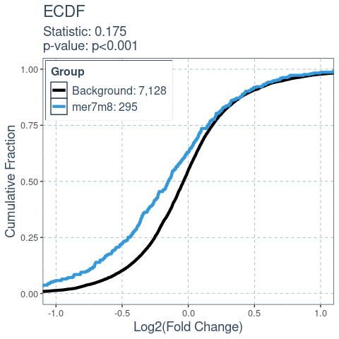

<!-- README.md is generated from README.Rmd. Please edit that file -->

# SeedMatchR version 2.0.0

The goal of SeedMatchR is to help users identify potential seed-mediated
effects in their RNA-seq data.

These changes in this forked repository is to add the biological target
bulges and wobbles in the search space.

## Installation

This version of SeedMatchR requires R ≥ 4.3.0, but it is recommended to
use the latest version of R to avoid issues with annotation retrieval
for newer genomes.

You can install the development version of SeedMatchR from
[GitHub](https://github.com/) or the stable build from CRAN.

``` r
# Install from GitHub
install.packages("devtools")

# Public Repository
devtools::install_github("tacazares/SeedMatchR")
```

## Quick start examples with public siRNA data

This example uses the siRNA sequence, D1, targeting the Ttr gene in rat
liver from the publication:

> Schlegel MK, Janas MM, Jiang Y, Barry JD, Davis W, Agarwal S, Berman
> D, Brown CR, Castoreno A, LeBlanc S, Liebow A, Mayo T, Milstein S,
> Nguyen T, Shulga-Morskaya S, Hyde S, Schofield S, Szeto J, Woods LB,
> Yilmaz VO, Manoharan M, Egli M, Charissé K, Sepp-Lorenzino L, Haslett
> P, Fitzgerald K, Jadhav V, Maier MA. From bench to bedside: Improving
> the clinical safety of GalNAc-siRNA conjugates using seed-pairing
> destabilization. Nucleic Acids Res. 2022 Jul 8;50(12):6656-6670. doi:
> 10.1093/nar/gkac539. PMID: 35736224; PMCID: PMC9262600.

The guide sequence of interest is 23 bp long and oriented 5’ -\> 3’.

``` r
# siRNA sequence of interest targeting a 23 bp region of the Ttr gene
guide.seq = "UUAUAGAGCAAGAACACUGUUUU"
```

### Load rat specific annotation data.

We use `AnnotationHub` to derive the `GTF` and `DNA` sequence files for
the species of interest. Once you have derived the annotations, you
could save them as an Rdata object to increase the speed of loading the
data sets. Running this function will take several minutes. Therefore it
might be helpful to save the objects and reload them later if you plan
to use this code in a repeated workflow.

#### Load annotation databases

``` r
annodb = load_annotations(reference.name = "rnor6", canonical = FALSE, min.feature.width = 8, longest.utr = T)
#> Build AnnotationFilter for transcript features based on the following parameters: 
#> Keep only standard chroms: TRUE
#> Remove rows with NA in transcript ID: TRUE
#> Keep only protein coding genes and transcripts: TRUE
#> Filtering for transcripts with support level: FALSE
#> Keep only the ENSEMBL canonical transcript: FALSE
#> Filtering for specific genes: FALSE
#> Filtering for specific transcripts: FALSE
#> Filtering for specific gene symbols: FALSE
#> Filtering for specific entrez id: FALSE
#> Loading annotations from AnnotationHub for rnor6
#> loading from cache
#> require("rtracklayer")
#> loading from cache
#> require("ensembldb")
#> Extracting 3UTR from ensembldb object.
#> Keeping the longest UTR per gene.
#> Extracting sequences for each feature.
#> Keeping sequences that are >= 8
```

## Example 1: Perform a comprehensive transcriptome search

The most straightforward way of using SeedMatchR is to search a
reference set of transcripts given an input sequence.

### Output match ranges as granges

``` r
res.df = SeedMatchR(seqs = annodb$seqs, 
                 sequence = guide.seq, 
                 seed.name = "mer7m8", 
                 res.format = "granges")
```

### Output match ranges for many different types of views of the siRNA

``` r
res.df = full_search(guide.seq, annodb$seqs, group.name = "Ttr")
```

## Example 2: Analyze RNA-seq data with SeedMatchR

### Prepare DESEQ2 Results

The test data that is provided with `SeedMatchR` was derived from the
2022 publication by Schlegel et al. The data set represents a DESeq2
analysis performed on rat liver that had been treated with Ttr targeting
siRNA. We will use this example to explore seed mediated activity.

Notes: \>The `SeedMatchR` function will look for specific column in the
input if using the `res` argument to map seed matches to differential
expression data. The input must contain the columns `gene_id`,
`log2FoldChange`, and `padj`.

#### Download data (only need to perform once, can skip to loading if done)

We start by downloading the example data set. This function will
download three files from the GEO accession
[GSE184929](https://www.ncbi.nlm.nih.gov/geo/query/acc.cgi?acc=GSE184929).
These files represent three samples with different siRNA treatments at
two dosages.

``` r
get_example_data("sirna")
```

#### Load example data

We can load the example data into the environment.

``` r
sirna.data = load_example_data("sirna")
```

The DESeq2 results are available through the names
`Schlegel_2022_Ttr_D1_30mkg`, `Schlegel_2022_Ttr_D4_30mkg` and
`Schlegel_2022_Ttr_D1_10mkg`. The data set name is long, so it will be
renamed to `res`.

``` r
res <- sirna.data$Schlegel_2022_Ttr_D1_30mkg
```

#### Filter example results

The DESeq2 results file is then filtered. The function `filter_res()`
can be used to filter a results file by log2FoldChange, padj, baseMean,
and remove NA entries.

``` r
# Dimensions before filtering
dim(res) # [1] 32883    8
#> [1] 32883     8

# Filter DESeq2 results for SeedMatchR
res = filter_res(res, fdr_cutoff=1, fc_cutoff=0)

# Dimensions after filtering
dim(res) # [1] 13582     8
#> [1] 8124    8
```

### Counting seed matches in transcripts

You can perform a seed match for a single seed using the `SeedMatchR()`
function.

Notes:

> The names of the sequences in `seqs` will determine if you need to use
> the `tx.id.col` argument. If you sequence names are gene IDs, then no
> additional flags need to be set. If they sequence names are
> transcripts, then the argument `tx.id.col` should be set to `TRUE`.
> This will summarize the transcript matches to the gene level using
> information in the gtf file.

``` r
res = SeedMatchR(res = res, 
                 seqs = annodb$seqs, 
                 sequence = guide.seq, 
                 seed.name = "mer7m8")

head(res, 2)
#>              gene_id  baseMean log2FoldChange     lfcSE      stat        pvalue
#> 1 ENSRNOG00000016275 2138.0945      -8.164615        NA -23.61818 2.507268e-123
#> 2 ENSRNOG00000000127  437.6342      -1.346927 0.1068629 -12.60425  2.000712e-36
#>            padj symbol mer7m8
#> 1 3.405371e-119    Ttr      1
#> 2  1.358683e-32  Kpna6      0
```

### Comparing the expression profiles of seed targets to background

Many factors that perturb gene expression, like miRNA, show cumulative
changes in their targets gene expression. Cumulative changes in the
profile of genes expression can be visualized and tested with the
emperical distribution function (ecdf) coupled with a statistical test
such as the Kolmogorov-Smirnov test.

`SeedMatchR` provides functions for comparing the log2(Fold Change) of
two gene sets. The function `deseq_fc_ecdf` is designed to work directly
with a DESeq2 results data frame.

Required Inputs:

-   `res`: DESeq2 results data frame
-   `gene.lists`: A list of lists containing gene names

``` r
# Gene set 1 
mer7m8.list = res$gene_id[res$mer7m8 >= 1]

# Gene set 2
background.list = res$gene_id[res$mer7m8 == 0]

ecdf.results = deseq_fc_ecdf(res, 
                             list("Background" = background.list, 
                                  "mer7m8" = mer7m8.list))

ecdf.results$plot
```


